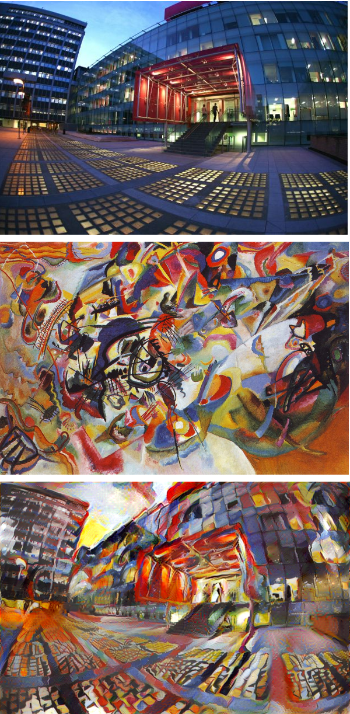

# Introduction

Implementation of the [artistic style transfer paper by Gatys et al.](http://arxiv.org/abs/1508.06576) 
 using the [Lasagne](http://lasagne.readthedocs.org/en/latest/) framework. 

The code should be run on a GPU. 

# Set up environment

If you don't have Lasagne already installed you can find instructions [here](http://lasagne.readthedocs.org/en/latest/user/installation.html). 
In particular, I recommend installing the bleeding edge versions of Theano and Lasagne:

    pip install --upgrade https://github.com/Theano/Theano/archive/master.zip
    pip install --upgrade https://github.com/Lasagne/Lasagne/archive/master.zip
  
You will also need `matplotlib`, `scikit-image`, `scikit-learn`, and `numpy`. 

    pip install matplotlib scikit-image scikit-image scikit-image
  
# Examples

A few examples of transferring styles from various art templates:

## Portraits

### A [self-portrait by Vincent van Gogh ](https://en.wikipedia.org/wiki/Portraits_of_Vincent_van_Gogh):

### A pencil sketch of a dog I found online:

### Part of a cartoon which I found online:

## Landscape examples

### Central square at Imperial South Kensington Campus with Kandinsky's "Composition VII".

### View of Queen's tower with the style of van Gogh's "Starry Night".

### View of the lawn in front of Queen's tower with Monet's ["The Summer, Poppy Field"](http://www.wikiart.org/en/claude-monet/the-summer-poppy-field).

